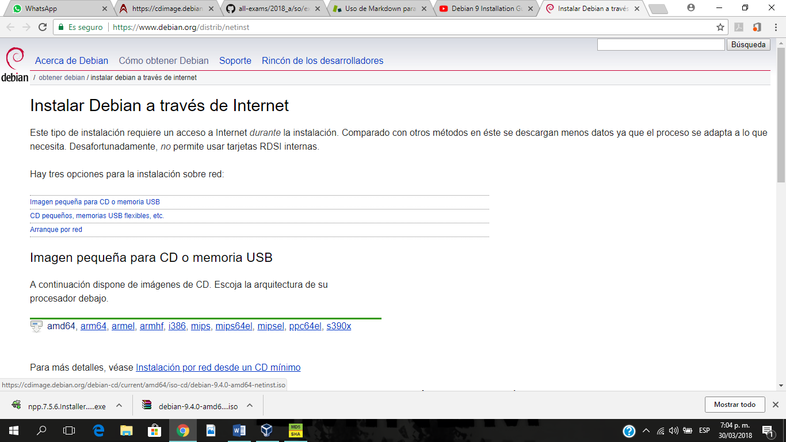
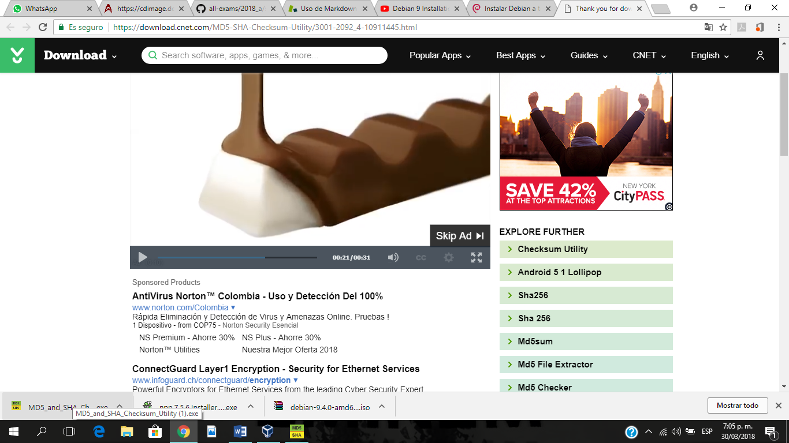
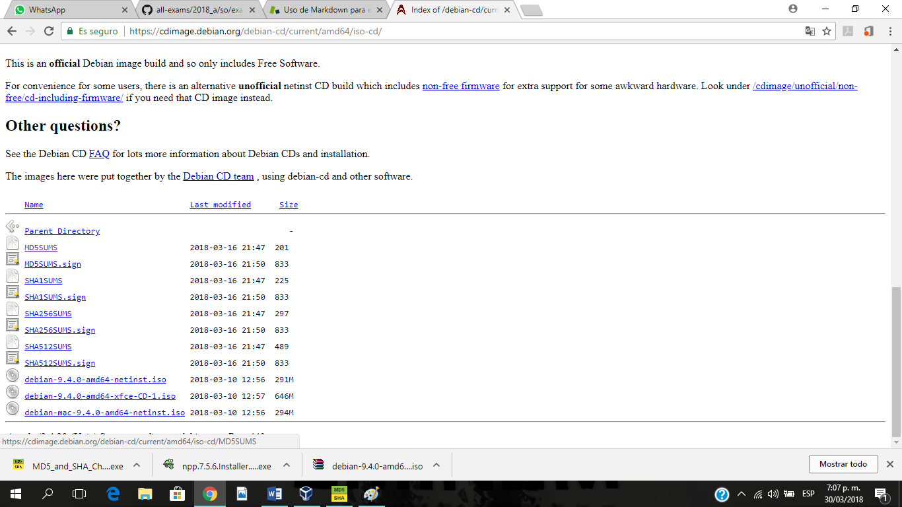
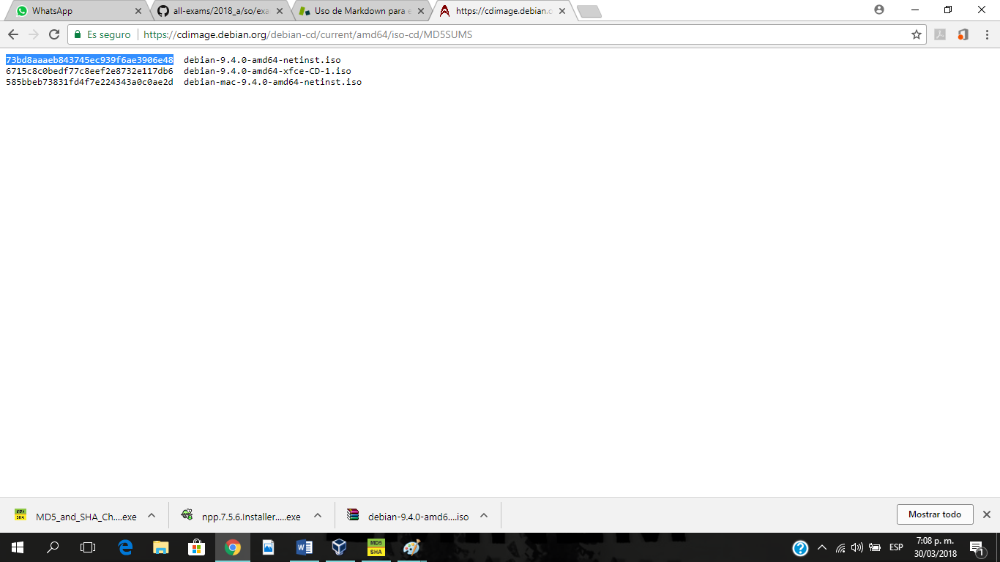
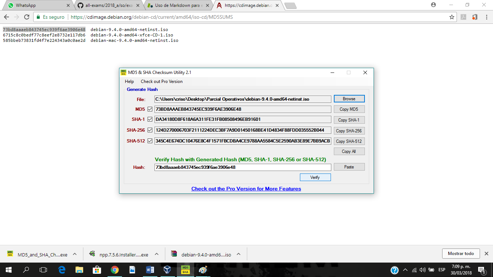
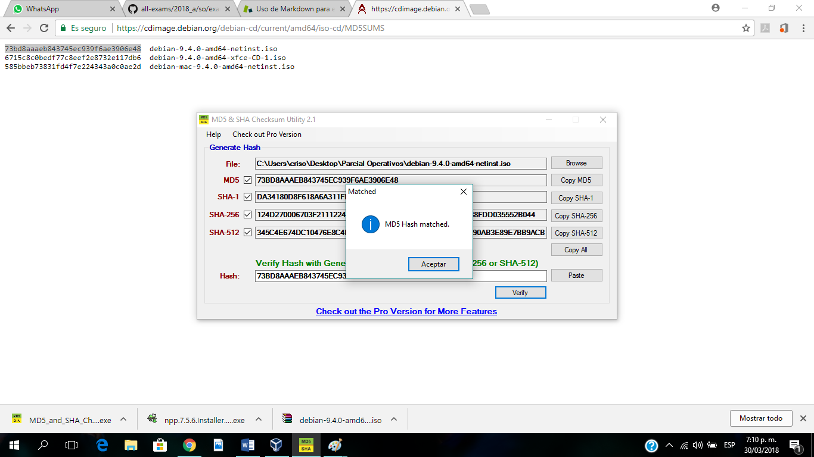
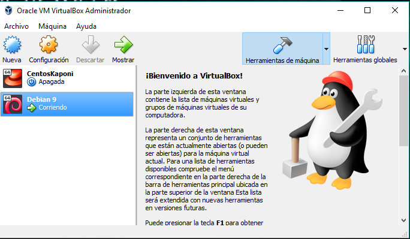

# Examen Parcial 1

**Nombre:** Cristian Osorio Trejos  
**Código:** A00056436  

## Descripción:

Con este examen, se evaluarán los objetivos de las unidades 1 y 2 del curso Sistemas Operacionales. Este documento incluirá cada punto del examen con su respectivo paso a paso
para la instalación del sistema operativo Debian 9 en VirtualBox o en WMWare, empleando comandos Linux para la realización de tareas administrativas y de virtualización.

Este documento será subido al siguiente repositorio: [https://github.com/ICESI-Training/so-exam1](https://github.com/ICESI-Training/so-exam1)

## **Validación de la imagen iso del sistema operativo Debian 9**

Primero se descarga la imagen iso del sistema operativo Debian 9 desde el siguiente enlace: [https://www.debian.org/distrib/netinst](https://www.debian.org/distrib/netinst) y ahí seleccionamos la arquitectura de nuestro computador, en mi caso seleccione amd64 porque la arquitectura de mi pc es de 64 bits y listo, en instantes se empieza a descargar la imagen iso.

Para realizar una comprobación de la imagen, primero debemos descargar el siguiente software: [http://download.cnet.com/MD5-SHA-Checksum-Utility/3001-2092_4-10911445.html](http://download.cnet.com/MD5-SHA-Checksum-Utility/3001-2092_4-10911445.html). Este programa nos permite comparar los valores del checksum de la imagen iso con los valores del checksum que están publicados para Debian 9 en la siguiente página web: [https://cdimage.debian.org/debian-cd/current/amd64/iso-cd/](https://cdimage.debian.org/debian-cd/current/amd64/iso-cd/) 

En la parte inferior de la página se encuentran las diferentes codificaciones para el checksum como MD5SUMS, SHA1SUMS, SHA256SUMS y SHA512SUMS. Se selecciona cualquiera de ellos, en mi caso seleccionare MD5SUMS para hacer la comparación. En el siguiente enlace está el archivo MD5SUMS: [https://cdimage.debian.org/debian-cd/current/amd64/iso-cd/MD5SUMS](https://cdimage.debian.org/debian-cd/current/amd64/iso-cd/MD5SUMS).

Por último, para realizar la comparación debemos copiar la fila de números hexadecimales que corresponde a la imagen iso descargada, en mi caso es **debian-9.4.0-amd64-netinst.iso**. Se copia el código en hexadecimal y se pega en el software MD5-SHA Checksum utility en la parte inferior, en la entrada de texto Hash. Una vez hecho lo anterior, procedemos a buscar nuestra imagen iso con el botón **Browse** de la herramienta, esperamos a que se generen los códigos checksum que contiene la iso y cuando ya estén generados procedemos a comparar presionando el botón **Verify**. Si todo sale exitoso, te saldrá un mensaje que dice **MD5 hash matched**, sino te saldrá un menaje de error. Si tienes error, te recomiendo descargar la imagen iso de la página oficial, la cual indique en el primer párrafo de este documento.

### **Capturas de pantalla para la validación de la imagen iso**

#### Primero

#### Segundo

#### Tercero

#### Cuarto

#### Quinto

#### Sexto

## **Configuración de la máquina virtual**

Para la instalación necesitamos VirtualBox o WMWara, en mi caso utilizare VirtualBox. Abrimos VirtualBox para configurar una nueva máquina virtual y en ella instalar debian 9.

***Para tener en cuenta***

Si vas a instalar un sistema operativo de 32 bits no hay problema alguno, pero si quieres instalar un sistema operativo de 64 bits, es necesario que verifiques que la tecnología de virtualización está habilitada en el BIOS de tu PC. Esto último puede ser necesario para algunos PCs que requieren tener esta tecnología habilitada para poder instalar un sistema operativo de 64 bits en una máquina virtual, como es el caso mío.

### **Continuemos**

Una vez abierto el VirtualBox, presionamos el icono **Nueva**, ahí ponemos el nombre de la máquina virtual, en mi caso le pondré Debian 9. Lo segundo es que el tipo se Linux y la versión sea Debian (64-bit). Una vez hecho lo anterior, presionamos en **Next**.

Ahora, configuramos el tamaño de la memoria RAM para la máquina virtual. Esto lo dejo a tu decisión y va de acuerdo con los recursos de memoria RAM que tengas en tu pc. En mi caso le pondré 4GB, ya que mi PC tiene una memoria RAM de 16GB. Hecho esto, presionamos en **Next**.

Estamos en la sección de crear un disco duro, en este caso seleccionamos la opción **crear disco duro virtual ahora** y presionamos el botón **Crear**. Luego seleccionamos la opción **VDI (Virtual Disk Image)** y presionamos **Next**. Para el almacenamiento tendrás que decidir si se reserva dinámicamente por el sistema o tiene un tamaño fijo. Si es reservado dinámicamente, es decir que este va a consumir más recurso de tu disco duro físico a medida que el sistema operativo en la máquina virtual lo requiera o Si es de tamaño fijo, tú le atribuyes el tamaño que desees de acuerdo con el recurso de disco duro que poseas. En mi caso seleccionare tamaño fijo y le pondré un tamaño de 20GB ya que mi disco duro físico es de 1TB. Por último, presionamos el botón **Crear**.

Hasta este último punto ya tenemos la máquina virtual creada, pero necesitamos hacer la configuración de red y montar la imagen iso para el arranque. Para hacer esto, seleccionamos nuestra máquina virtual y presionamos el icono **configuración**, una vez en configuración seleccionamos **Red** y en la pestaña **Adaptador 1** habilitamos el adaptador de red y que esté conectado a **NAT**, luego vamos a la pestaña **Adaptador 2** y habilitamos el adaptador de red nuevamente y lo conectamos a **Adaptador Puente**. Ahora vamos a **Sistema** y solo seleccionamos **Disco duro** y **óptica** y nos aseguramos de que el Disco duro este de primero. Después seleccionamos **Almacenamiento** y en controlador IDE seleccionamos el icono que dice **Vacío** y en la parte derecha hacia el extremo seleccionamos el icono de un **disco** y después seleccionamos la opción **Seleccione archivo de disco óptico virtual …** y buscamos la imagen iso de debian 9 que descargamos anteriormente, la seleccionamos y presionamos el botón **Abrir** y por último, damos clic al botón **Aceptar**. Hemos finalizado la configuración de la máquina virtual.

### **Captura de pantalla de la máquina virtual configurada**.

## **Instalación de la imagen iso de Debian 9**

En VirtualBox iniciamos nuestra máquina virtual y procedemos a realizar la instalación de debian 9. Seguimos los pasos de instalación a continuación. 

1)	Seleccionamos en **graphical install**.

2)	Seleccionamos el idioma, la ubicación y el teclado. En mi caso seleccione español, Colombia y teclado latinoamericano. Esperamos a que se carguen los componentes del instalador de la imagen iso de debian.

3)	Configuramos la interfaz de red primaria seleccionando la **enp0s3**, después configuramos el nombre de la maquina como **debian** y seguido de eso, si tenemos un dominio lo ponemos y si no, se deja en blanco y presionamos en continuar.

4)	Configuramos una clave nueva para el usuario **root (administrador del sistema)**.

5)	Se crea una nueva cuenta de usuario, en mi caso le pondré **Cristian Osorio Trejos**, después creamos un nombre de usuario para la cuenta que se acabó de crear, le llamaré **crisosotre**, pues tiene que ser en minúscula y puede o no tener combinación de números y por último fijamos una contraseña para este usuario.

6)	Ahora vamos a particionar el disco, seleccionando la opción **Guiado – utilizar todo el disco**, el paso siguiente es elegir el disco a particionar, es aquel y único que sale en la pantalla. Continuando, seleccionamos el esquema de particionado como **Todos los ficheros en una partición (recomendado para novatos)**, elegimos esta opción si somos novatos y sino pues seleccionamos alguna de las otras dos opciones que nos aparecen; damos clic en continuar y seleccionamos la opción **Finalizar el particionado y escribir los cambios en el disco**, escribimos los cambios en el disco y esperamos a que se instale el sistema base.

7)	Si tenemos un gestor de paquetes, le damos en la opción de analizar otro DVD sino es el caso dejamos en No. Después seleccionamos el país de réplica de debian, en mi caso es Colombia y seleccionamos **debian.uniminuto.edu** como replica y presionamos en continuar.

8)	Ahora, vamos a seleccionar los programas que se van a instalar junto al sistema base, primero seleccionamos **Entorno de escritorio debian**, seleccionamos **…GNOME**, tercero **web server**, cuarto **servidor de impresión**, quinto y muy importante seleccionar el **SSH server** y por último seleccionamos **Utilidades estándar del sistema** y listo, esperamos aproximadamente una hora a que se instale todo.

9)	Instalamos el cargador de arranque GRUB en el disco duro de la máquina virtual y listo presionamos en continuar y dejamos que la máquina virtual se reinicie y se cargue debian para usarlo por primera vez.

### **Capturas de pantalla para la instalación de Debian 9**

## **Comandos utilizados para mostrar información del sistema operativo**

1)	Abrimos el terminal, ejecutamos el comando **su – root** para ingresar como usuario root.

2)	Ejecutamos el comando **uname** para que nos brinde información sobre el tipo de kernel del sistema operativo. En mi caso es Linux.

3)	Ejecutamos el comando **uname -s** para ver el tipo de sistema operativo. En mi caso es Linux.

4)	El comando **uname -n** sirve para ver el nombre de la máquina, en este caso es debian.

5)	El comando **uname -a** nos muestra toda la información de la maquina como el kernel, el sistema operativo, la distribución, la arquitectura, la publicación del kernel e información que contiene el kernel.

6)	El comando **uname-m** nos muestra la arquitectura del sistema, en mi caso es x86_64, la cual indica una arquitectura de 64 bits y es interesante porque podemos ver si la maquina tiene soporte para virtualización.

7)	El comando **uname -v** nos muestra la versión y fecha de publicación del kernel.

8)	El comando **uname -r** nos muestra la versión del kernel.

9)	El comando **uname -p** nos va a consultar el tipo de procesador que tenemos.

10)	El comando **Uname -o** no dice que sistema operativo estamos utilizando. En mi caso GNU/Linux.

11)	El comando **arch** nos dice la arquitectura del procesador.

12)	Con la sentencia **dmidecode** se tiene información respecto al hardware del sistema, el BIOS, la versión del BIOS, el fabricante o ensamblador del dispositivo, el fabricante de la placa base, el fabricante de la CPU, etc.

13)	Con el comando **dmidecode -s** desplegamos una lista de todo lo que podemos consultar acerca del hardware y del fabricante del sistema.

14)	El comando **dmidecode -s system-manufacturer** muestra información sobre el fabricante del sistema.

15)	El comando **dmidecode -s processor-manufacturer** muestra informacion del fabricante del procesador.

16)	El comando **dmidecode -s system-version** nos da la versión del sistema.

17)	El comando **dmidecode -s system-serial-number** nos da el numero serie del sistema.

18)	El comando **cat /proc/versión** nos brinda información más detallada sobre el kernel del sistema, nos dice la versión del compilador GCC, el nombre de la persona que compiló el kernel y la fecha de compilación.

19)	El comando **cat /proc/cpuinfo** nos da información detallada de la CPU con sus diferentes núcleos, datos del fabricante, numero de núcleos, frecuencia de reloj, memoria cache, etc.

20)	El comando **date** nos dice la fecha y hora actual del sistema.

21)	El comando **cal** nos muestra el calendario del mes actual.

22)	El comando **ip a** nos brinda información sobre la dirección ip de la máquina, el broadcast, la dirección de red y la MAC.

En el siguiente enlace se encuentra el archivo de texto con los comandos utilizados para obtener la información del sistema:[https://github.com/crisosotre/so-exam1/blob/crisosotre/so-exam1/A00056436/comandos_infosistema.txt](https://github.com/crisosotre/so-exam1/blob/crisosotre/so-exam1/A00056436/comandos_infosistema.txt).

***Existen más comandos para ver la información del sistema, he mostrado cuales son importantes y cuales son interesantes de explorar***.

### **Capturas de pantalla de los comandos utilizados**

## **Configuración interfaz tipo puente** 

La configuración de red con un adaptador tipo puente ya se ha hecho previamente y esta documenta en la parte superior de este documento en la sección de **Configuración de la máquina virtual**. Ahí se explica paso a paso lo que se necesita para configurar una interfaz tipo puente.

## **Haciendo uso de Putty para acceder a la máquina virtual**

Primero es necesario descargar putty del siguiente enlace: [https://www.chiark.greenend.org.uk/~sgtatham/putty/latest.html](https://www.chiark.greenend.org.uk/~sgtatham/putty/latest.html). Se debe seleccionar el **putty.exe** de 32 bits o de 64 bits dependiendo de tu máquina, en la sección **(the SSH and Telnet client itself)**. Una vez descargado Putty y haber configurado la interfaz tipo puente, procedemos a abrir Putty para configurar lo siguiente:

1)	El **Host Name**, que es la dirección IP de la máquina virtual. La dirección IP de la máquina virtual se puede ver con el comando **ip a** y es aquella que se muestra por la interfaz **enp0s8**.

2)	Se pone la dirección IP en el campo de texto y se guarda la sesión poniendo el nombre que deseamos, seguido de eso presionamos el botón Open.

3)	Se pide el login y el password para acceder, introducimos nuestro usuario que creamos inicialmente cuando instalamos Debian y respecivamente introducimos la contraseña.

Listo ya hemos accedido a la máquina virtual desde putty. ***Hay que tener en cuenta que la máquina virtual debe estar iniciada***.

### **Capturas de pantalla de la configuración de Putty**

## **Instalando git y tig**

1)	Iniciamos como **root**.

2)	Instalamos git con el comando **$ apt-get install git -y**

3)	Instalamos tig con el comando **$ apt-get install tig -y**

4)	Ahora usaremos git para clonar el repositorio dando el comando **git clone** y la url del repositorio. 

5)	Usaremos tig para ver el historial de commits hechos en el repositorio.

6)	Cambiamos con cd de directorio a so-exam1 utilizando el comando **cd so-exam1**

7)	Verificamos que estamos en la rama master con **git branch -a** y cambiamos a nuestra rama con **git checkout crisosotre/so-exam1**.

8)	Luego ejecutamos el comando **tig** para ver el historial de commits que se han hecho al repositorio.

## **Exportar la máquina virtual**

Para realizar esto, se debe tener la máquina virtual apagada y obviamente tenemos que tener abierto nuestro VirtualBox.

1-	Damos clic en la pestaña **Archivo** y luego clic en **Exportar servicio virtualizado**.

2-	Seleccionamos nuestra máquina virtual, en mi caso seleccionare Debian 9. Y damos clic en **Next**.

3-	Elegimos donde queremos guardar nuestra máquina virtual y damos clic en **Next**.

4-	Damos clic en **Exportar** y esperamos a que termine de exportar y listo.

## **Importar la máquina virtual**

1-	Abrimos VirtualBox y vamos a la pestaña Archivo y seleccionamos la opción **Importar servicio virtualizado**.

2-	Elegimos nuestra máquina virtual, en mi caso Debian 9.

3-	Damos clic en **Importar**, esperamos a que se importe y listo.

## **Cuadro comparativo entre Debian 9 y Centos 7**
